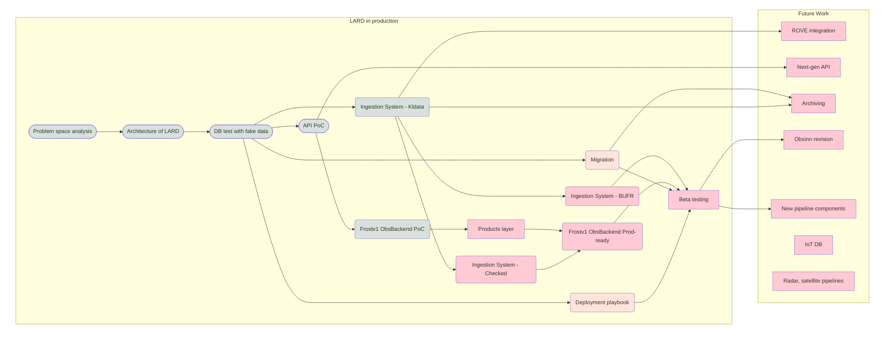

## Issue Flowchart

```mermaid
%%{ init : { "theme" : "default" }}%%
flowchart TD
subgraph main [ ]
    subgraph lard[LARD in production]
        psa([Problem space analysis]):::done
        arc([Architecture of LARD]):::done
        test([DB test with fake data]):::done
        poc([API PoC]):::done
        frostb1(Frostv1 ObsBackend PoC):::done
        ingestkldata(Ingestion System - Kldata):::done

        migrate(Migration):::wip
        depl(Deployment playbook):::wip

        ingestbufr(Ingestion System - BUFR):::backlog
        ingestchecked(Ingestion System - Checked):::backlog
        products[Products layer]:::backlog
        frostb2(Frostv1 ObsBackend Prod-ready):::backlog
        beta[Beta testing]:::backlog

        psa --> arc
        arc --> test
        test --> poc & ingestkldata & migrate & depl
        poc --> frostb1
        frostb1 --> products
        ingestkldata --> ingestbufr & ingestchecked
        products & ingestchecked --> frostb2
        ingestbufr & frostb2 & migrate & depl --> beta
    end
    subgraph "Future Work"
        rove[ROVE integration]:::backlog
        next[Next-gen API]:::backlog
        archive[Archiving]:::backlog
        obsinn[Obsinn revision]:::backlog
        pipe[New pipeline components]:::backlog
        iot[IoT DB]:::backlog
        radsat[Radar, satellite pipelines]:::backlog
    end

    poc --> next
    migrate & ingestkldata --> archive
    beta --> obsinn & pipe
    ingestkldata --> rove

end
    classDef done fill:#d8e2dc
    classDef wip fill:#ffe5d9
    classDef backlog fill:#ffcad4
    classDef bkg fill:#fff,stroke:#fff
    class main bkg
```

### Prospective Ranked Priority of Future Work:
- Archiving
- Obsinn revision
- Next-gen API
- New pipeline components
- Radar, satellite pipeline
- IoT DB
